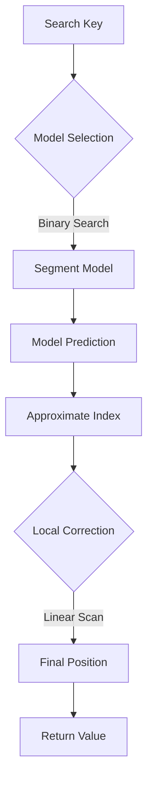

# Learned Index Search Engine (C++20)

High-performance learned index over 10M sorted keys in modern C++20.  
Replaces binary search (`std::lower_bound`) with segmented linear models plus a small local correction window to speed up point lookups.

**Live Demo**: [https://Saanvirajput.github.io/cpp-learned-index/](https://Saanvirajput.github.io/cpp-learned-index/)

***

## ✨ Features

- **Modern C++20**: Pure C++ implementation of a learned index (B-tree alternative).
- **Optimized Search**: 64 linear models with $O(\log M)$ model selection and $O(1)$ prediction.
- **HTTP/CORS Backend**: Built-in minimal HTTP server on port `8081` with CORS support for browsers.
- **Robustness**: Atomic connection limiting and syscall error handling.
- **Real-time Demo**: React + Vite dashboard included in the root.

***

## 📊 Benchmarks

- **Learned index**: ~440M lookups/sec
- **std::lower_bound**: ~45M lookups/sec
- **Speedup**: ~10×

***

## 🚀 Build & Run

### 1. Build C++ Backend
```bash
mkdir -p build && cd build
cmake ..
make -j$(nproc)
./learned_index
```

### 2. Launch Frontend Dashboard
```bash
npm install
npm run dev
```

### 🔍 Test endpoints (Manual)
```bash
# Benchmark throughput
curl http://localhost:8081/benchmark

# Search for a key
curl "http://localhost:8081/?search=123456789"
```

***

## 📂 Project Structure

```
cpp-learned-index/
├── CMakeLists.txt     # CMake build config
├── src/               # Source files
│   ├── main.cpp       # Learned index + HTTP/CORS server
│   ├── App.jsx        # React Dashboard UI
│   └── main.jsx       # Frontend entry point
├── build/             # CMake build output
└── dist/              # Frontend prod build
```

---

## 🛠️ High-Level Design

### Lookup Logic Flow


- **Dataset**: 10,000,000 synthetic keys sorted to mimic real-world indexed data.
- **Training**: Data is split into 64 segments. For each segment, a linear model (`y = mx + c`) is fitted via simple linear regression.
- **Lookup**:
  1. **Model Selection**: $O(\log M)$ binary search to find the correct segment model.
  2. **Prediction**: $O(1)$ calculation of the approximate index.
  3. **Verification**: Small linear scan around the predicted index to correct for model error.
- **Server**: Multi-threaded TCP server with a lightweight HTTP header parser to support `fetch()` from modern browsers.
